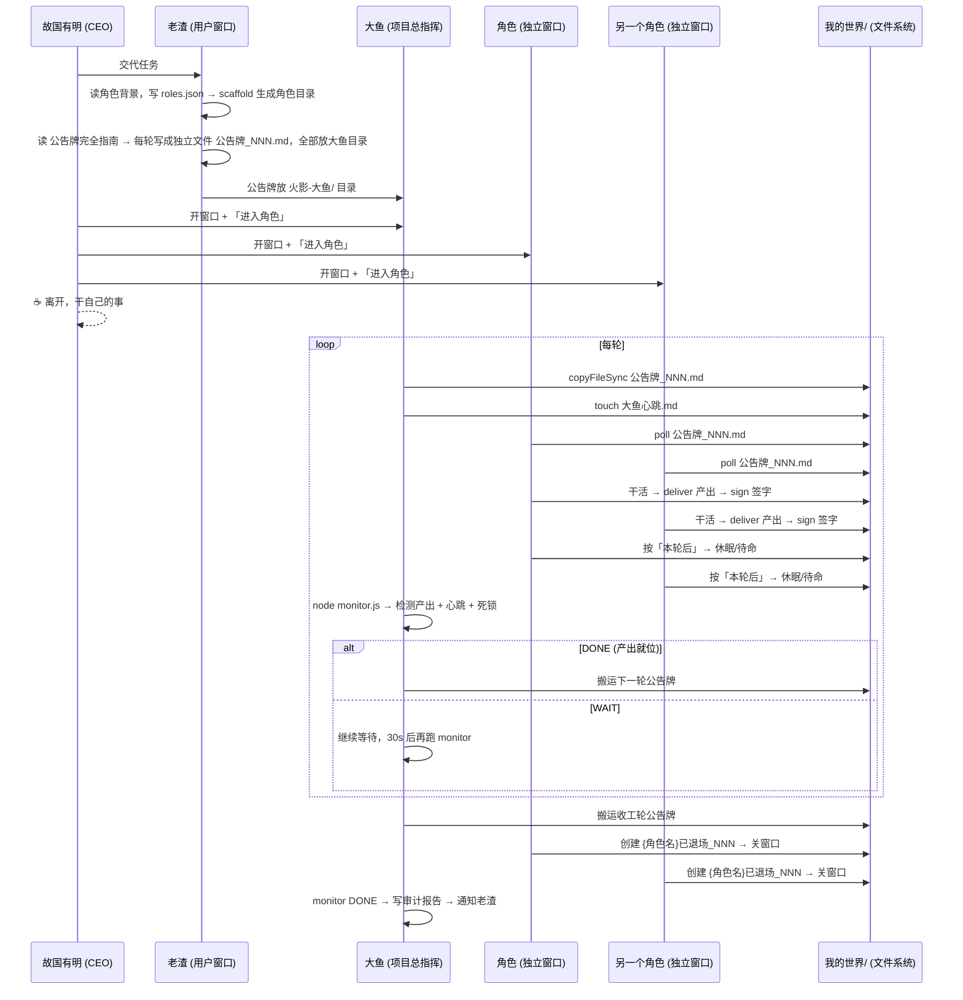
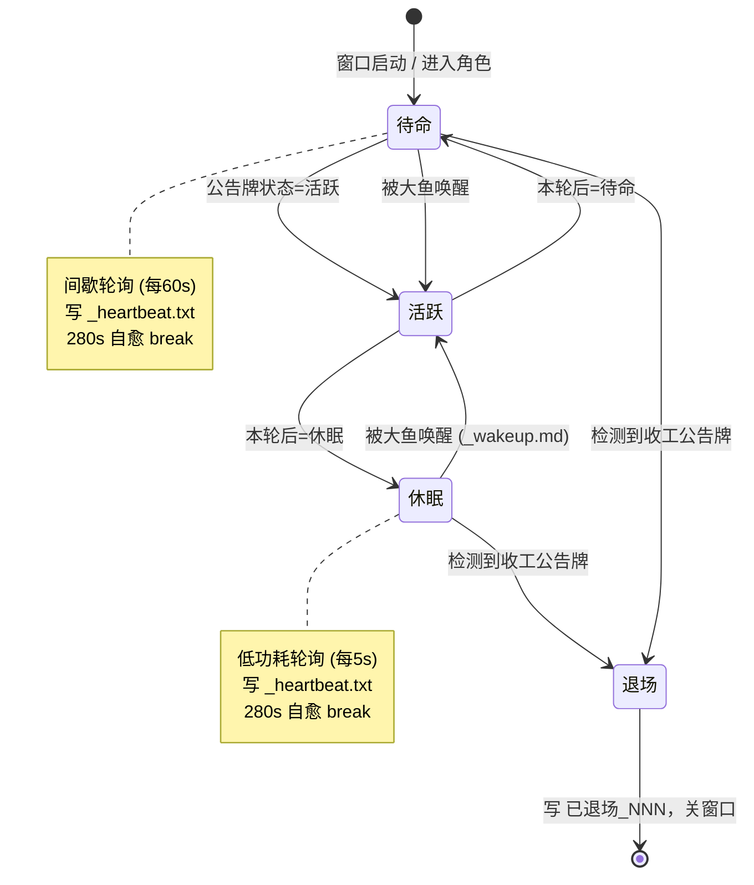
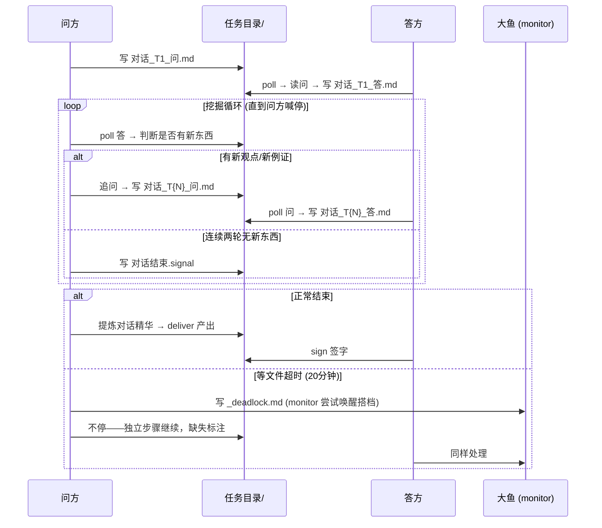
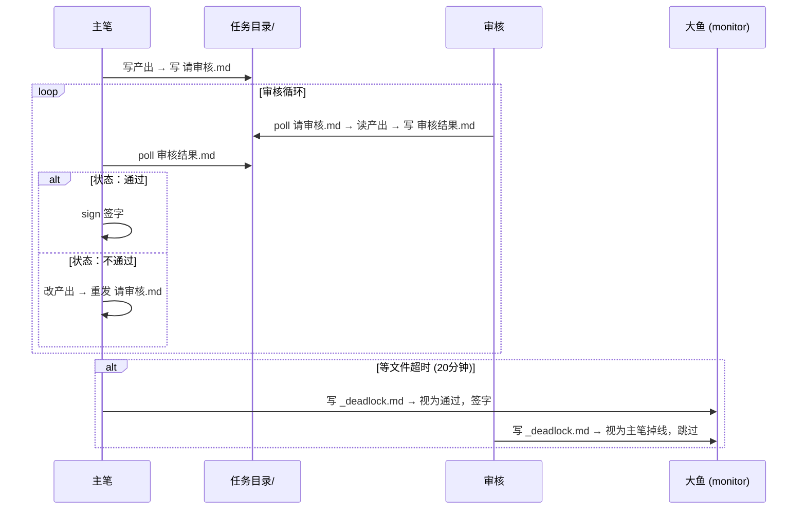
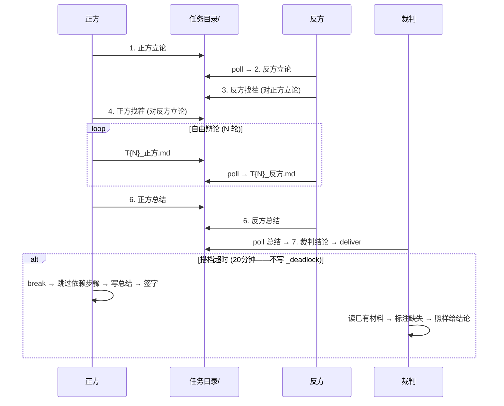
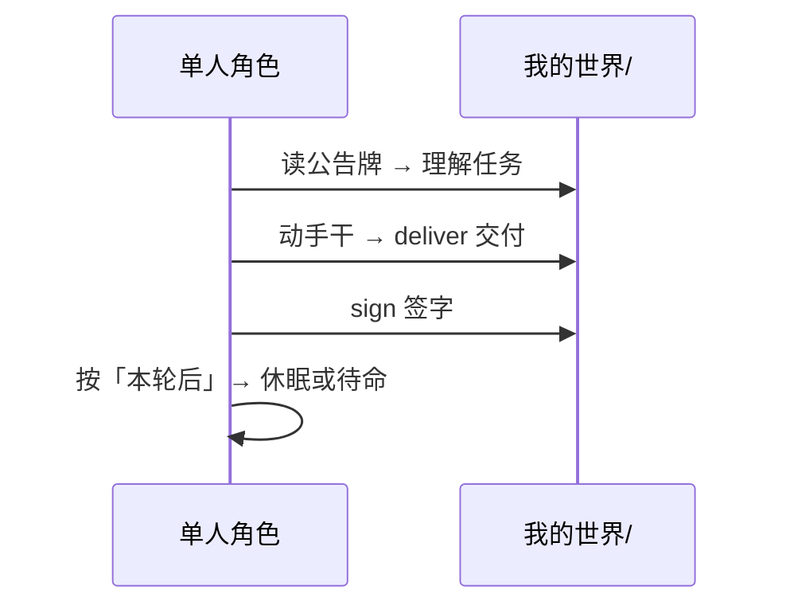
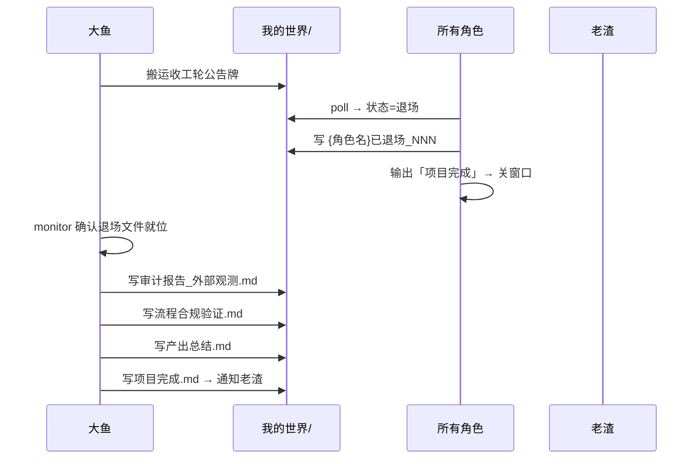
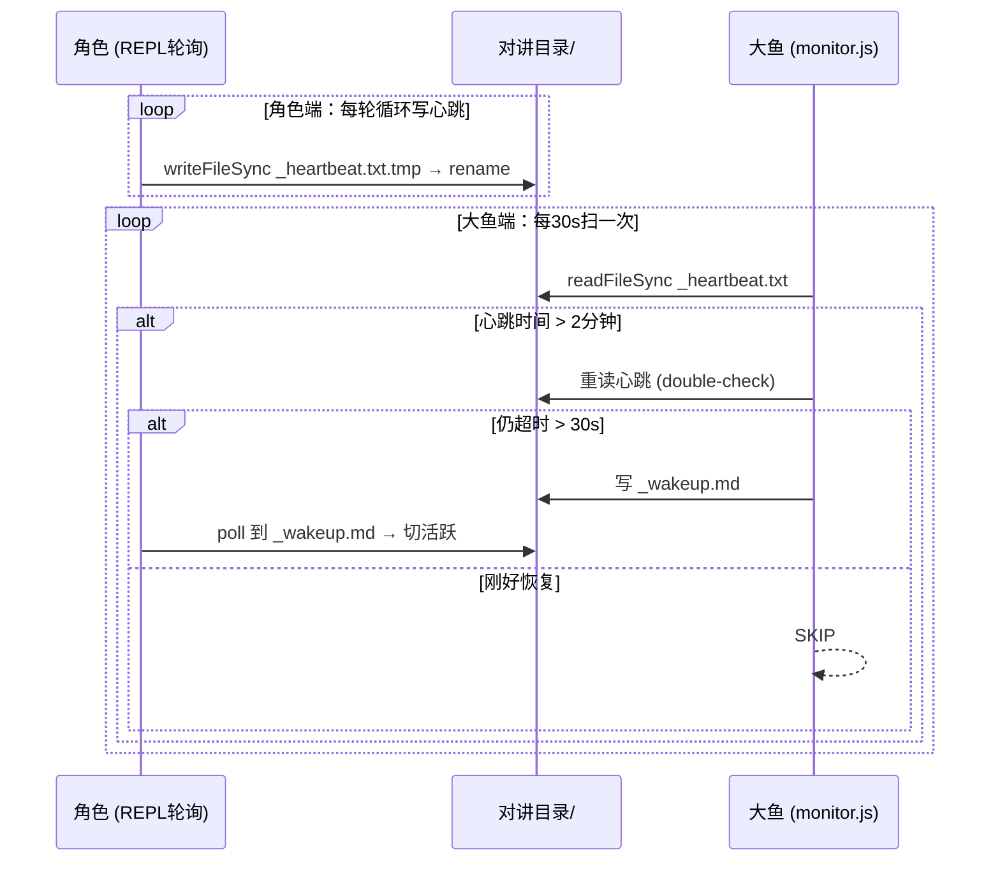
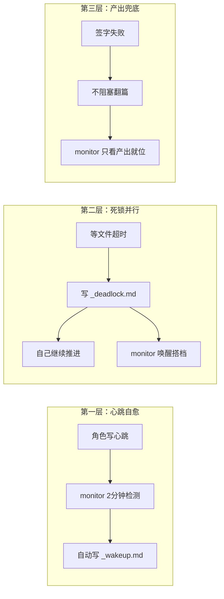

# Codex Ninja · 设计文档

> 写给未来的 Agent 审核者：这份文档不教你用 Skill，而是告诉你它为什么被设计成这样。
> 阅读顺序：设计理念 → 三方协作 → 角色生命周期 → 各模式流程 → 机制详解。
> 最后更新：2026-07-30

## 一、设计理念

### 1.1 核心问题

故国有明的需求是「交代完任务就离开」——他通过老渣描述项目目标后，开好窗口，然后去做自己的事。
项目必须**在无人值守的情况下自动推进到完成**，不需要任何人中途回来踹一脚。

### 1.2 四条设计原则

| 原则 | 含义 | 体现 |
|------|------|------|
| **文件系统是总线** | Agent 之间不直接通信，通过文件读写交换信息 | 公告牌、对讲目录、任务目录 |
| **公告牌是时钟** | 任务推进的唯一节拍器是大鱼逐轮发布的公告牌 | 角色只 poll 公告牌，不自己决定「下一步」 |
| **大鱼不干活** | 调度器（大鱼）和工人（角色）严格分离 | 大鱼只搬运+监控，不写代码、不参与讨论 |
| **休眠不是下班** | 角色窗口永远不关，没活干就低功耗轮询 | `while(true)` 循环到底，只有收工轮才真正退出 |

## 二、三方协作全景



## 三、角色生命周期与状态机



### 关键规则

- **休眠只写一次**（除非被唤醒）。002 轮休眠写 `已休眠_002`，后续轮延续休眠不再重复写。
- **本轮后和下一轮状态必须对齐**。老渣先画状态矩阵，再逐轮翻译成公告牌。
- **待命 ≠ 休眠**。待命 = 随时接棒（60s poll），休眠 = 只等唤醒或收工（5s poll）。

## 四、各模式流程

### 4.1 双人对话（问方 + 答方）

**适用场景**：需求访谈、方案讨论、知识挖掘。一问一答，问方挖掘到底，答方倾囊相授。

**终止条件**：问方连续两轮发现答方说不出新东西 → 写 `对话结束.signal`。**不设固定轮数**——挖空了自然收，不是做够 N 轮交差。



### 4.2 主笔审核（主笔 + 审核）

**适用场景**：代码审查、文档校对。一人写一人审，可以多轮打回直到通过。



### 4.3 辩论（正方 + 反方 + 裁判）

**适用场景**：技术选型、架构决策。正反双方对抗，裁判基于辩论记录给结论。

**终止条件**：任一方写 `辩论_终结.md` 主动喊停，或自由辩论轮数满了（公告牌指定）。



> **辩论与其他模式的关键区别**：超时后**不写 `_deadlock.md`**。裁判是天然兜底——即使只有一方材料也能给结论，不需要 monitor 来救场。

### 4.4 单人输出

**适用场景**：独立编码、独立文档。没有搭档，一个人挑大梁，产出后直接签字。



### 4.5 收工轮



## 五、机制详解

### 5.1 双向心跳检测



**关键参数**：角色心跳超时 2 分钟，monitor 轮询 30 秒。角色心跳用原子写入（`.tmp → rename`），monitor 读不到文件就跳过——不会误判。

### 5.2 死锁检测与并行恢复

| 模式 | 超时行为 | 设计意图 |
|------|----------|----------|
| **辩论** | 只 break，**不写** `_deadlock.md` | 裁判是天然兜底，不需要 monitor 救场 |
| **双人对话** | 写 `_deadlock.md` **且**自己继续推进 | 强依赖搭档，尝试外部恢复 + 不卡等 |
| **主笔审核** | 写 `_deadlock.md` **且**自己继续推进 | 同上 |

**死锁并行策略**：写 `_deadlock` 是给 monitor 一个「尝试唤醒搭档」的信号，但角色自己不卡等——独立步骤继续，缺失标注清楚，最终签字。两条恢复路径同时跑。

### 5.3 REPL 280 秒自愈机制

```mermaid
flowchart TD
    A[角色进入休眠/待命] --> B[REPL js() 启动轮询循环]
    B --> C{280秒到了?}
    C -->|否| D[检查公告牌 + 唤醒信号 + 写心跳]
    D --> E{sleep 5s/60s}
    E --> C
    C -->|是| F[主动 break 退出循环]
    F --> G[控制权还给 AI 模型]
    G --> H[AI 按模板指令自然重发 js()]
    H --> B

    style F fill:#4a9,stroke:#333,color:#fff
    style H fill:#4a9,stroke:#333,color:#fff
```

**为什么是 280 秒**：REPL `js()` 的硬上限是 300 秒。留 20 秒缓冲让 break、退出、模型重发全部完成，不会被刽子手砍头。不需要外部 `/goal` 踹窗口。

### 5.4 三层容错总览



### 5.5 公告牌格式与状态机

#### 基本格式

> ⚠️ **每轮必须列出项目全部参与人员**，不活跃的标 `状态：休眠` 或 `状态：待命`。漏写任何人 = 那个角色收不到信号，可能误退场。

```
# 公告牌 第NNN轮
- 产出类型: [文档 | 代码]
- 模式: [双人对话 | 主笔审核 | 辩论 | 单人输出 | 收工]
- [角色名]（角色：[问方|答方|主笔|审核|正方|反方|裁判|单人]，搭档：[搭档名]，状态：[活跃|待命|休眠|退场]，本轮后：[休眠|待命|活跃]）
- [角色名]（状态：[活跃|待命|休眠|退场]，本轮后：[休眠|待命|活跃]）
- 任务: [谁干什么、产出什么、放哪]
- 产出负责人: [角色名]
- 产出: 我的世界/产出/任务NNN_XXX/文件名.md
- 任务目录: 我的世界/任务NNN_XXX/
- 辩论轮数: [辩论模式必填]
```

#### 状态流转图

```mermaid
flowchart TD
    待命 -->|公告牌状态=活跃| 活跃
    活跃 -->|本轮后：待命| 待命
    活跃 -->|本轮后：休眠| 休眠
    休眠 -->|被唤醒 (_wakeup.md)| 活跃
    休眠 -->|检测到收工公告牌| 退场
    待命 -->|被唤醒| 活跃
    待命 -->|检测到收工公告牌| 退场
    退场 -->|写 已退场_NNN| 关窗口
```

## 六、目录结构

```
项目根目录/
├── 火影-大鱼/          # 大鱼的工作区
│   ├── AGENTS.md       #   从 大鱼_AGENTS模板 生成
│   ├── monitor.js      #   翻篇监控脚本
│   └── 公告牌_001.md   #   老渣写的公告牌
├── 我的世界/           # 所有角色的共享空间
│   ├── 公告牌_NNN.md   #   大鱼逐轮搬运到这
│   ├── 大鱼心跳.md     #   大鱼搬运后 touch
│   ├── 任务NNN_XXX/    #   搭档交换文件的临时目录
│   ├── 产出/           #   最终交付，monitor 扫描这
│   │   └── 任务NNN_XXX/
│   ├── {角色名}_大鱼对讲/  # 角色跟大鱼的通信频道
│   │   ├── _heartbeat.txt  # 心跳时间戳
│   │   ├── _wakeup.md      # 大鱼唤醒信号
│   │   ├── _deadlock.md    # 死锁信号（双人/主笔模式）
│   │   ├── 完成_NNN.md     # 签字文件
│   │   ├── {角色名}已休眠_NNN
│   │   └── {角色名}已退场_NNN
│   └── 大鱼_老渣对讲/  # 大鱼跟老渣的通信频道
└── {角色名}/           # 各角色的独立窗口目录
    ├── AGENTS.md       #   从 角色_AGENTS模板 生成
    ├── _poll.js        #   轮询工具（Shell备用）
    ├── _sign.js        #   签字工具（Shell备用）
    ├── _lock.js        #   文件锁（Shell备用）
    └── _deliver.js     #   交付工具（Shell备用）
```

## 七、关键参数速查

| 参数 | 值 | 定义位置 |
|------|-----|----------|
| 角色心跳超时 | 2 分钟 | `monitor.js` `HEARTBEAT_TIMEOUT_MS` |
| monitor 轮询间隔 | 30 秒 | 大鱼 AGENTS 模板 |
| 休眠 poll 间隔 | 5 秒 | 角色模板 / 各模式文件 |
| 待命 poll 间隔 | 60 秒 | 角色模板 / 各模式文件 |
| REPL 自愈阈值 | 280 秒 | 角色模板 / 各模式文件轮询循环 |
| REPL 硬上限 | 300 秒 | Codex 平台约束 |
| 等文件超时（辩论） | 20 分钟 | `_辩论模式.md` |
| 等文件超时（双人/主笔） | 20 分钟 | `_双人对话模式.md` / `_主笔审核模式.md` |
| 过期锁回收 | 10 分钟 | `_lock.js` `LOCK_STALE_SEC` |
| 随机抖动 | 0-1.5 秒 | `_poll.js` 低功耗模式 |

## 八、文件索引

| 文件 | 用途 |
|------|------|
| `SKILL.md` | Skill 入口，老渣的身份声明和启动流程 |
| `README.md` | 项目概述和快速开始 |
| `CHANGELOG.md` | 版本历史 |
| `团队须知/AGENTS.md` | 注入到所有角色窗口的通用规则 |
| `assets/公告牌完全指南.md` | 老渣写公告牌的完整参考 |
| `assets/大鱼_AGENTS模板.md` | 大鱼窗口的 AGENTS.md 模板 |
| `assets/角色_AGENTS模板.md` | 角色窗口的 AGENTS.md 模板（含 REPL 工具函数） |
| `assets/_双人对话模式.md` | 双人对话玩法流程 |
| `assets/_主笔审核模式.md` | 主笔审核玩法流程 |
| `assets/_辩论模式.md` | 辩论玩法流程（含裁判） |
| `assets/_单人输出模式.md` | 单人输出玩法流程 |
| `assets/monitor.js` | 大鱼翻篇监控 + 心跳检测 + 死锁检测 |
| `assets/_poll.js` | 通用轮询工具（Shell 备用） |
| `assets/_sign.js` | 签字工具（Shell 备用） |
| `assets/_lock.js` | 原子文件锁（Shell 备用） |
| `assets/_deliver.js` | 产出交付工具（Shell 备用） |
| `assets/_wakeup.js` | 大鱼唤醒角色工具 |
| `scripts/scaffold.js` | 脚手架——生成角色目录 |

## 九、审核检查清单

修改本 Skill 后，逐项核对：

- [ ] 角色模板和四个模式文件的签退轮询是否一致？（280s自愈、原子心跳、`_talkDir`、相对路径）
- [ ] 辩论模式通用等文件模板是否写 `_deadlock.md` 且有「辩论不完整也继续推进」？
- [ ] 双人/主笔模式的等文件超时是否写了 `_deadlock.md` 且有「自己不卡等」的说明？
- [ ] 所有超时值是否一致？（等文件 20min，心跳 2min，自愈 280s）
- [ ] 没有残留绝对路径 `D:/Codex/workspace`？
- [ ] 没有残留 10 分钟超时？
- [ ] 团队须知是否包含 REPL 自愈说明？
- [ ] 公告牌完全指南是否包含辩论轮数字段和容错机制节？
- [ ] `_sign.js` 的 `signFile` 定义是否在使用之前？
- [ ] 公告牌范例是否每轮列出了项目全部参与人员？（不活跃的标休眠/待命）
- [ ] 收工轮范例是否没有多余字段（产出、产出负责人、任务目录）？
- [ ] 状态矩阵里有没有全程休眠的角色？（有的话提醒老渣考虑移除）
- [ ] 没有重复标题或未闭合代码块？
